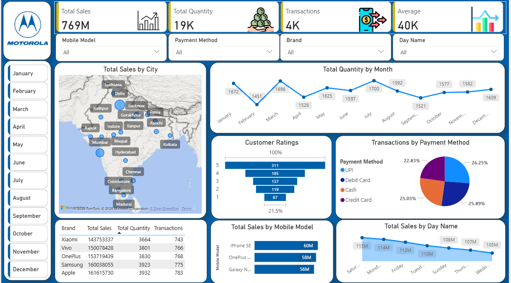

# 🧾 Sales Performance Dashboard (Power BI)

A Power BI dashboard project to analyze and visualize sales performance using key KPIs and interactive visuals.

## 📊 Overview
This dashboard provides insights into:
- Revenue trends over time
- Regional sales performance
- Top products by revenue
- Profit margins and customer segmentation

## 🛠️ Tools & Technologies
- Power BI (Data Modeling, DAX, Visualizations)
- Excel (Data Source)
- Power Query (Data Cleaning & Transformation)

## 📁 Project Structure
sales-dashboard/
├── Sales_Dashboard.pbix # Main Power BI report file
├── data/
│ └── sales_data_sample.xlsx # Sample dataset
└── README.md

## 🖼️ Dashboard Preview
